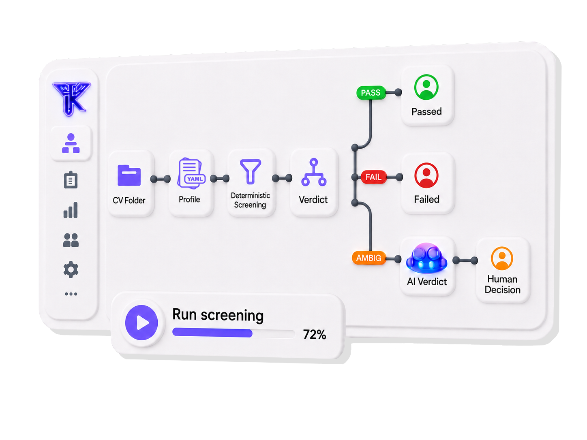

<p align="center">
  
</p>
<h1 align="center">Kriterion</h1>

<p align="center">
  <strong>AI-powered CV screening — just tell it what you're looking for.</strong><br>
  Talk to Kriterion through GitHub Copilot to screen hundreds of resumes in seconds.<br>
  No flags to memorize, no config files to write manually.
</p>

<br>

<p align="center">
  <a href="#ai-usage"></a>
  <a href="#requirements"></a>
  <a href="#supported-formats"></a>
  <a href="#incremental-runs"></a>
  <a href="#security--privacy"></a>
</p>

<p align="center">
  <a href="#ai-usage">AI Usage</a>
  &nbsp;&bull;&nbsp;
  <a href="#quick-start">Quick Start</a>
  &nbsp;&bull;&nbsp;
  <a href="#how-it-works">How It Works</a>
  &nbsp;&bull;&nbsp;
  <a href="#html-dashboard">Dashboard</a>
  &nbsp;&bull;&nbsp;
  <a href="#cli-reference">CLI Reference</a>
  &nbsp;&bull;&nbsp;
  <a href="#troubleshooting">Troubleshooting</a>
</p>

---

## Why The Name Kriterion?

**Kriterion** comes from the Ancient Greek
[*kritērion* (κριτήριον)](https://www.merriam-webster.com/dictionary/criterion):
a standard, test, or means by which something is judged. It is also the origin
of the English word **criterion**.

The name reflects how Kriterion works. It evaluates every candidate against
explicit hiring criteria, shows the evidence behind each result, and separates
clear decisions from cases that still require human judgment.


## AI Usage

Kriterion integrates with **GitHub Copilot** — just talk to it in natural language. Open Copilot Chat in VS Code and use `@kriterion`:

### Create a screening profile

```
@kriterion create a profile for Senior Backend Engineer
```

Copilot walks you through a few questions:
- What role are you hiring for?
- Minimum years of experience?
- What skills must appear in their work experience?
- Any programs/companies/universities to filter?

Then it generates a ready-to-use profile file in `profiles/`.

### Scan CVs

```
@kriterion scan the CVs in ./cvs using profiles/senior_backend_engineer.yaml
```

Or even simpler:

```
@kriterion screen candidates for the DevOps role
```

Kriterion runs the screening, opens the interactive dashboard, and keeps the webserver attached to the terminal until you press `Ctrl+C`.

### More examples

| What you say | What happens |
|---|---|
| `@kriterion create a profile for SRE` | Guided profile creation |
| `@kriterion scan ~/candidates/batch2` | Screen CVs in that folder using default profile |
| `@kriterion screen using profiles/backend.yaml` | Screen `./cvs` with specific profile |
| `@kriterion what profiles do I have?` | Lists available profiles |

---

## Quick Start

```bash
# 1. Clone and set up
git clone https://github.com/Ahmadshata/Kriterion.git && cd Kriterion
./setup.sh

# 2. Drop CVs into the cvs/ folder
cp ~/Downloads/*.pdf ./cvs/

# 3. Talk to Copilot
# @kriterion create a profile for Senior DevOps Engineer
# @kriterion scan cvs
```

Or run directly:

```bash
./kriterion.sh
```

The dashboard opens automatically in your browser. Kriterion then runs as a normal foreground webserver; press `Ctrl+C` when you are finished.

---

## How It Works

<p align="center">
  
</p>

```text
┌─────────────┐     ┌───────────────┐     ┌────────────────────┐     ┌────────────────┐
│             │────▶│  Text Extract │────▶│  Screening Engine  │────▶│ HTML Dashboard │
│  CV Folder  │     │  PyMuPDF      │     │  Date Parsing      │     │ Excel / CSV    │
│  PDF / DOCX │     │  python-docx  │     │  Keyword Matching  │     │ Markdown       │
│             │     │  OCR (opt)    │     │  Scoring + Verdict │     │                │
└─────────────┘     └───────────────┘     └────────────────────┘     └────────────────┘
```

| Step | What Happens |
|------|--------------|
| **Extract** | Text pulled from each PDF/DOCX page by page |
| **Parse** | Experience section identified; entries split by date ranges |
| **Match** | Required keywords searched with synonym expansion (e.g., `kubernetes` matches `k8s`) |
| **Calculate** | DevOps years computed from overlapping-safe unique months |
| **Score** | Weighted confidence score (0–100) assigned per candidate |
| **Verdict** | Clear PASS / FAIL / AMBIGUOUS with specific reasons |
| **Report** | Interactive HTML dashboard opens automatically |

---

## Requirements

| Requirement | Notes |
|-------------|-------|
| **Python** | 3.9 or higher |
| **OS** | macOS, Linux, or Windows |
| **Setup** | Run `./setup.sh` once — handles everything |

The setup script installs Kriterion's agent and skills for both supported assistants:

- GitHub Copilot: `~/.copilot/agents/` and `~/.copilot/skills/`
- Claude: `~/.claude/agents/` and `~/.claude/skills/`

Running setup again refreshes only Kriterion's installed files from the canonical copies under `.github/`.

### AI provider for candidate review

Kriterion currently defaults its dashboard AI calls to the authenticated Codex CLI
for temporary testing. Codex runs non-interactively in an ephemeral, read-only
workspace and Kriterion displays only the validated output—no credit-usage panel.

```bash
# Temporary testing default
./kriterion.sh --ai-provider codex

# Restore the original GitHub Copilot path at any time
./kriterion.sh --ai-provider copilot
```

You can also set `KRITERION_AI_PROVIDER=codex|copilot`. GitHub Copilot mode retains
its exact GitHub AI Credit display. A cached result from one provider is never reused
under the other provider, so switching produces a fresh result.

AI verdict and Interview Architect results are cached in
`.kriterion_ai_cache/` at the output root and reused across date-stamped report runs.
Cache entries are accepted only when the provider, schema, parsed work experience,
screening context, profile, and relevant cohort context still match. `--no-cache`
starts with fresh AI artifacts as well as fresh deterministic screening results.

Install the GitHub Copilot extension in VS Code for the conversational `@kriterion`
experience. The dashboard provider requires its corresponding authenticated `codex`
or `copilot` CLI.

### Optional: OCR for scanned PDFs

```bash
pip install pytesseract pillow
brew install tesseract        # macOS
```

---

## Profile Configuration

Profiles define what you're looking for. Create them via Copilot (`@kriterion create a profile`) or manually:

```yaml
role: Senior DevOps Engineer
min_experience_years: 3
include_freelance_experience: true

must_have_in_experience:
  - kubernetes
  - aws
  - helm

education_programs:
  - iti
  - nti
  - sprints
  - depi
  - alx

preferred_programs: null
excluded_companies: null
excluded_universities: null
min_score: null
```

| Field | Purpose |
|-------|---------|
| `role` | Names the output directory |
| `min_experience_years` | Minimum relevant years to pass |
| `include_freelance_experience` | Whether freelance/self-employed entries supply experience years and required-skill evidence |
| `must_have_in_experience` | Keywords that must appear in experience entries (synonym-aware) |
| `education_programs` | Programs whose time is excluded from experience count |
| `preferred_programs` | Candidate must have attended one (null to skip) |
| `excluded_companies` | Reject if worked here (null to skip) |
| `excluded_universities` | Reject if attended here (null to skip) |
| `min_score` | Minimum confidence score threshold (null to skip) |

Store profiles in `profiles/` for multi-role setups.

---

## HTML Dashboard

The report is a fully interactive single-page app:

- Candidate table with score bars and clear outcome badges
- Click any row for a clean inline review with rationale, requirement evidence, career history, and screening notes
- Pass/Fail/Ambiguous filter buttons with donut chart
- Dark/Light mode toggle
- Clickable CV filenames open the source PDF
- Deterministic semantic relationships: demonstrated AKS/EKS/GKE usage can satisfy Kubernetes
- AI Verdict appears only for ambiguous candidates and runs automatically in the served dashboard
- AI returns a PASS/FAIL verdict with exact, locally verified CV quotations
- The reviewer makes the authoritative final PASS/FAIL decision
- Interview Architect highlights every defensible ambiguous-evidence, strong-claim,
  career-gap, overlap, or date-conflict issue and creates exactly one question for each,
  including what to listen for and locally verified work-experience citations
- Static HTML remains shareable; AI features require the local served dashboard

---

## Screening Logic

### Keywords checked in experience, not skills lists

A keyword that only appears in a "Skills" section but never in an actual job entry does **not** count. This prevents keyword-stuffing.

### Synonym expansion (60+ tools mapped)

Write `kubernetes` — the tool also matches `k8s`, `kube`. Write `aws` — matches `amazon web services`. Over 60 DevOps tools are pre-mapped.

### Deterministic semantic relationships

Related products are not treated as simple synonyms. For example, AKS is a managed Kubernetes service rather than another spelling of Kubernetes:

- “Managed AKS clusters in production” is accepted as deterministic managed-Kubernetes usage.
- “Azure services: AKS, Functions” is marked ambiguous because usage is unclear.
- No Kubernetes or related evidence remains a deterministic failure.

The built-in, versioned relationship map currently covers AKS, EKS, GKE, OpenShift, Rancher, and Tanzu Kubernetes Grid for Kubernetes requirements.

### Ambiguity-only AI Verdict

AI is never used to reconsider clear passes or failures. When the served dashboard opens, each ambiguous candidate is automatically sent to the selected AI provider in sequence. The provider receives only Kriterion's parsed work-experience entries—not skills, certifications, courses, education, or projects—and returns a conservative PASS/FAIL verdict addressing only the unresolved criteria. Kriterion rejects out-of-scope evidence, forces FAIL when an already-deterministic requirement is missing, and verifies every quotation against the parsed work experience. The reviewer then records the authoritative final PASS or FAIL. This human decision is stored separately and does not rewrite Kriterion's original deterministic `AMBIGUOUS` result.

Use `--no-auto-ai` when ambiguous CVs must not be transmitted automatically. The reviewer can still request each AI verdict manually from the dashboard.

### Interview Architect

Interview Architect is available only on passed candidates and runs when the reviewer
clicks **Analyze issues & build questions**. The selected provider receives the parsed
work-experience section and screening context, then returns one merged issue list in
three groups: ambiguous evidence, strong claims, and timeline signals. Every positive
blank-month career gap and every defensible overlap or date conflict is included. Each
issue gets exactly one interview question, a specific **Listen for** guide, and one or
two exact citations that Kriterion verifies locally against the parsed CV. Empty groups
remain visible instead of inventing a concern.

Strong Claims prioritizes quantified assertions such as “70% faster,” “99.9% available,”
release-frequency changes, latency, cost, recovery time, incident reduction, and scale.
Its question probes the baseline, metric definition, measurement source and period,
implementation, validation or testing, sustained result, and the candidate’s personal
attribution.

### Overlapping-safe year calculation

DevOps years = unique months across all relevant roles. Concurrent roles don't double-count.
Each career-history row displays that role's calendar tenure, so an overlapping role
never appears as `0.0 yr` merely because another role already contributed those months
to the unique total.

Set `include_freelance_experience: false` to remove freelance and self-employed
entries from both the overlap-safe year total and must-have technology evidence. The
profile-creation agent asks this explicitly for every new profile.

### Education program detection

Training programs (ITI, NTI, etc.) listed under "Experience" are reclassified as education — their duration is excluded from the year count.

### Transparent verdicts

Every decision has a specific reason:

| Verdict | Example |
|---------|---------|
| **PASS** | All criteria met |
| **FAIL** | Missing: helm |
| **FAIL** | Insufficient experience: 2.83 yr (need 3.0) |
| **AMBIGUOUS** | Date or related-technology evidence requires manual review |

---

## Incremental Runs

Re-running only processes **new or changed** CVs:

```text
Cached: 42 | New/Changed: 5 | Removed: 0
```

Delete `manifest.json` to force a full re-run.

Or bypass both the screening manifest and saved AI-review decisions for one run:

```bash
./kriterion.sh --no-cache
```

---

## Output Structure

```
.kriterion_ai_cache/          ← Shared, fingerprinted AI cache across dated runs
├── semantic_reviews.json     ← AI verdicts
└── interview_plans.json      ← Interview Architect results

Senior_DevOps_Engineer_2026-07-30/
├── screening_report.html     ← Interactive dashboard (auto-opens)
├── screening_report.md       ← Markdown report
├── screening_results.csv     ← Spreadsheet import
├── screening_results.xlsx    ← Color-coded Excel
├── manifest.json             ← Incremental run cache
├── extracted/                ← Extracted CV text used by local AI actions
├── semantic_reviews.json     ← AI verdicts, verified evidence + human decisions
├── interview_plans.json      ← Report-local Interview Architect cache
├── icon.png                  ← Dashboard favicon
├── passed_cvs/               ← Copies of passing CVs
├── failed_cvs/               ← Copies of failing CVs
└── ambiguous_cvs/            ← Copies of ambiguous CVs
```

---

## CLI Reference

For users who prefer the command line:

```bash
# Default (uses ./cvs and ./profiles/profile.yaml)
./kriterion.sh

# Custom CV folder
./kriterion.sh --cvs-dir ./my-cvs

# Custom folder, profile, and output parent
./kriterion.sh --cvs-dir ./my-cvs --profile ./profiles/backend.yaml --output-dir ./reports

# Keep the server in the foreground without opening a browser
./kriterion.sh --no-open

# Rescreen every CV and regenerate ambiguous AI reviews
./kriterion.sh --no-cache

# Direct Python with flags
python3 kriterion.py ./cvs --profile profiles/profile.yaml --output-dir ./out
python3 kriterion.py ./cvs --min-devops-years 3 --required-keyword kubernetes --required-keyword aws
python3 kriterion.py ./cvs --profile profiles/profile.yaml --min-score 70 -v
```

| Flag | Description | Default |
|------|-------------|---------|
| `--cvs-dir` | Path to CV folder | `./cvs` |
| `--output-dir` | Output directory | `.` |
| `--profile` | YAML profile path | `./profiles/profile.yaml` |
| `--min-devops-years` | Override min experience | From profile |
| `--required-keyword` | Override keywords (repeatable) | From profile |
| `--min-score` | Min score threshold | None |
| `--no-serve` | Generate static output without the AI server | Off |
| `--no-open` | Run the foreground server without opening a browser | Off |
| `--no-auto-ai` | Require manual AI Verdict requests for ambiguous CVs | Off |
| `--no-cache` | Rescreen every CV and discard saved AI reviews and decisions | Off |
| `-v` | Verbose scoring output | Off |

`kriterion.sh` is a thin launcher: it does not install dependencies, activate an environment, inspect the profile, or prompt for input. Run `./setup.sh` separately when installation is needed. Additional options are forwarded to `kriterion.py`.

---

## Troubleshooting

| Problem | Solution |
|---------|----------|
| Keywords not detected | Must appear in experience entries, not just Skills section |
| Stale results | Delete `manifest.json` and re-run |
| OCR not working | `brew install tesseract` + `pip install pytesseract pillow` |
| Excel not generated | `pip install openpyxl` (included in setup) |
| AI Verdict unavailable | It appears only for ambiguous candidates; install/authenticate the `copilot` CLI and open the served dashboard URL |
| Copilot or Claude not recognizing Kriterion | Re-run `./setup.sh`, then refresh the assistant's agent and skill list |

---

## Security & Privacy

| Behavior | Detail |
|----------|--------|
| **Local-first screening** | Extraction, matching, scoring, and report generation run locally |
| **Scoped AI use** | Only ambiguous CVs are sent to GitHub Copilot; this happens automatically by default and can be disabled with `--no-auto-ai` |
| **Loopback-only server** | The dashboard server binds to `127.0.0.1` and protects AI endpoints with a random session token |
| **Verified evidence** | Every AI evidence snippet must match parsed work-experience text or the verdict is rejected |
| **Human control** | AI PASS/FAIL is advisory; the final human decision is stored separately in `semantic_reviews.json` and never silently changes deterministic screening output |
| **Foreground server** | The server stays attached to the terminal and stops explicitly with `Ctrl+C` |

---

## Project Structure

```
kriterion/
├── kriterion.py               ← Entry point (main + argparse)
├── kriterion.sh               ← Shell wrapper
├── setup.sh                   ← One-command setup
├── profiles/
│   ├── profile.yaml           ← Default role profile
│   └── ...                    ← Additional role profiles
├── .github/
│   ├── agents/
│   │   └── kriterion.agent.md ← Canonical custom agent
│   └── skills/
│       ├── create-profile/SKILL.md
│       └── scan-cvs/SKILL.md
├── assets/                    ← Icons and media
├── cvs/                       ← Input folder (your CVs)
└── requirements.txt
```

---

## License

Apache License 2.0. See `LICENSE`.

---

<p align="center">
  <sub>Built by <strong>Ahmed Shata</strong></sub>
</p>
